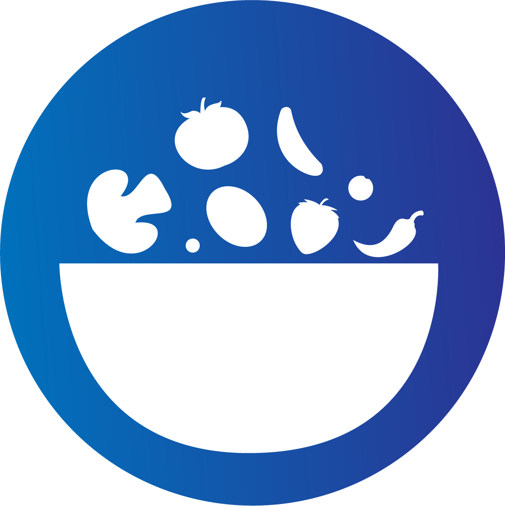
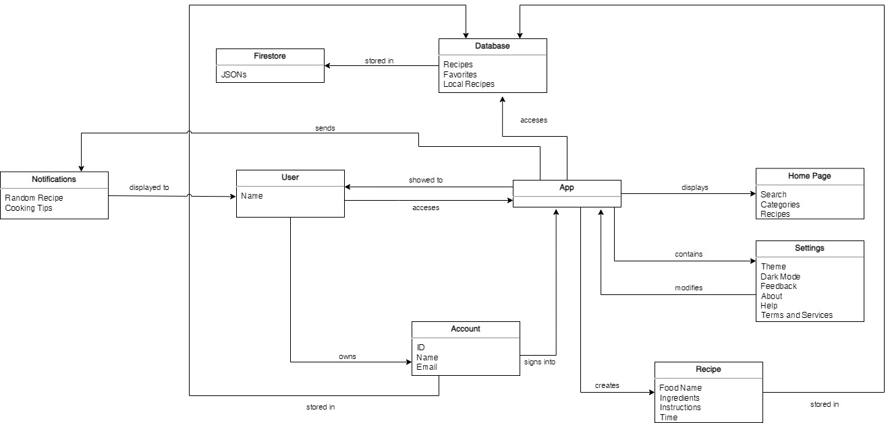

# Recipe Stash Project Overview

Recipe Stash is a user-friendly recipe organizer that guides you along your culinary journey. With its seamless features, Recipe Stash allows you to effortlessly store, manage, and share your favorite recipes. From organizing your go-to weeknight dinners to saving your most cherished family recipes, Recipe Stash streamlines the process. Enjoy the convenience of categorizing, editing, and saving recipes according to your preferences. Its robust synchronization across various devices ensures that your recipes are readily accessible wherever you go. In addition to personal use, Recipe Stash also lets you share your culinary discoveries with friends and family, fostering a vibrant community of food enthusiasts. Elevate your cooking adventures with Recipe Stash and unlock a world of flavors right at your fingertips.

# List of Features

###### Dialogs and pickers

- Save recipe confirmation
- Delete recipe confirmation
- Select picture
- Share
- Print
- Delete all recipe confirmation
- Switch account popup
- Color picker for theme
- Notification picker popup

###### Multiple screens and navigation

- Bottom navigation bar for navigating purposes
- Home screen (list recipes)
- Account screen
- Settings screen
- Recipe adding screen
- Detailed Recipe screen
- Login screen

###### Snack bars

- Recipe saved/created
- Recipe deleted (with undo)
- Deleted all recipe (with undo)
- Switched account
- Shared

###### Notifications

- Daily random recipe suggestion
- Daily cooking tips and tricks

###### Local storage (SQLite)

- Stores the user's recipes locally using SQLite

###### Cloud storage (Firestore)

- Recipe data
- User data

###### HTTP requests

- Sync data between local and cloud

###### Camera

- Take pictures to add for a recipe

# Group members and Responsibilities

###### Project Planning

- Md Tanjeem Haider
- Ayman Zahid
- Razeen MeeraAmeer

###### UI Design

- Md Tanjeem Haider*
- Razeen MeeraAmeer

###### Front End Development

- Razeen MeeraAmeer*
- Md Tanjeem Haider

###### Back End Development

- Md Tanjeem Haider*
- Ayman Zahid
- Razeen MeeraAmeer

###### Testing & Quality Assurance

- Md Tanjeem Haider*

###### Code Clean-up & Refactoring

- Md Tanjeem Haider*

###### Documentation & User help

- Ayman Zahid*
- Md Tanjeem Haider

The asterisk (\*) denotes the team lead for each respective task. The absence of the asterisk (\*) all together signifies an even distribution of responsibilities without a designated team lead.

# Code Design (UML)

# UI Mockup

